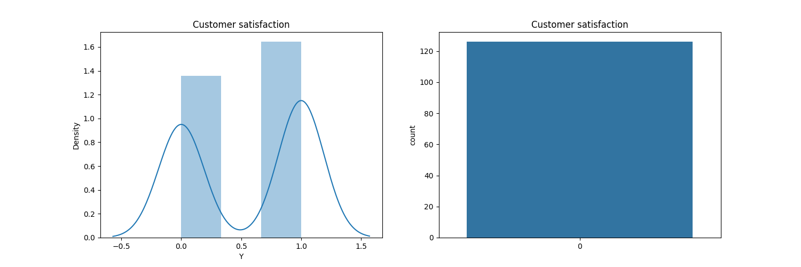
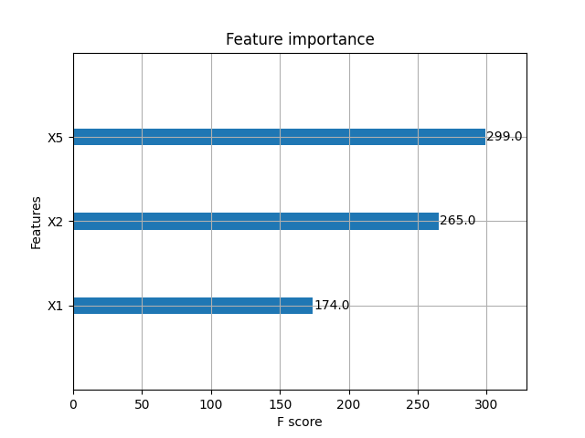
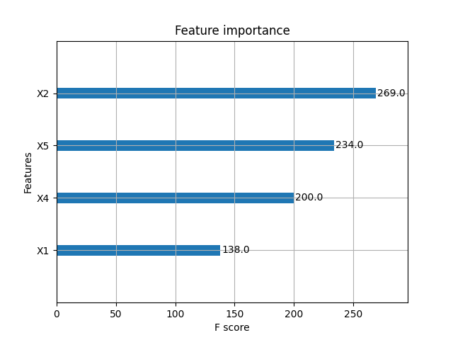

Customer satisfaction prediction
==============================

About the dataset
----------------

This problem revolves around using survey to a select customer cohort.  We will be using the remaining data as a private test set.

Data Description:

* Y = target attribute (Y) with values indicating 0 (unhappy) and 1 (happy) customers
* X1 = my order was delivered on time
* X2 = contents of my order was as I expected
* X3 = I ordered everything I wanted to order
* X4 = I paid a good price for my order
* X5 = I am satisfied with my courier
* X6 = the app makes ordering easy for me

Attributes X1 to X6 indicate the responses for each question and have values from 1 to 5 where the smaller number indicates less and the higher number indicates more towards the answer.

Goal(s):
---------

Predict if a customer is happy or not based on the answers they give to questions asked.

Success Metrics:
----------------

Reach 73% accuracy score or above, or convince us why your solution is superior. We are definitely interested in every solution and insight you can provide us.

Results
-------

#### Exploratory data analysis

The plots below give us a sense for the kinds of responses submitted to the survey, along with the customer satisfaction.





#### Feature engineering results

Iterating through variables and through XGBoost, we obtained the following

```
Features: ('X1', 'X5'), Accuracy: 0.7307692307692307
Features: ('X1', 'X2', 'X5'), Accuracy: 0.7692307692307693
Features: ('X1', 'X2', 'X4', 'X5'), Accuracy: 0.7692307692307693
```

Picking X1, X2, X5 yields



```
Accuracy:  0.7692307692307693
              precision    recall  f1-score   support

           0       0.80      0.80      0.80        15
           1       0.73      0.73      0.73        11

    accuracy                           0.77        26
   macro avg       0.76      0.76      0.76        26
weighted avg       0.77      0.77      0.77        26
```

Whereas if we pick X1, X2, X4, X5 we get



```
Accuracy:  0.7692307692307693
              precision    recall  f1-score   support

           0       0.85      0.73      0.79        15
           1       0.69      0.82      0.75        11

    accuracy                           0.77        26
   macro avg       0.77      0.78      0.77        26
weighted avg       0.78      0.77      0.77        26
```


Project template
--------

<p><small>Project based on the <a target="_blank" href="https://drivendata.github.io/cookiecutter-data-science/">cookiecutter data science project template</a>. #cookiecutterdatascience</small></p>
